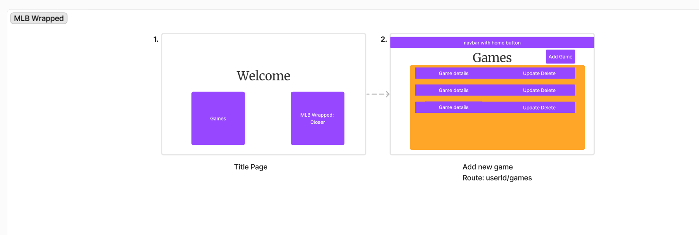
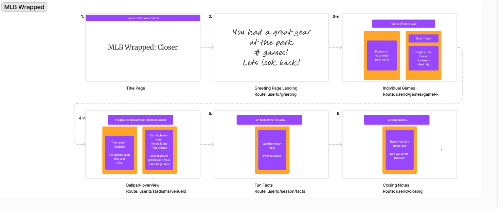
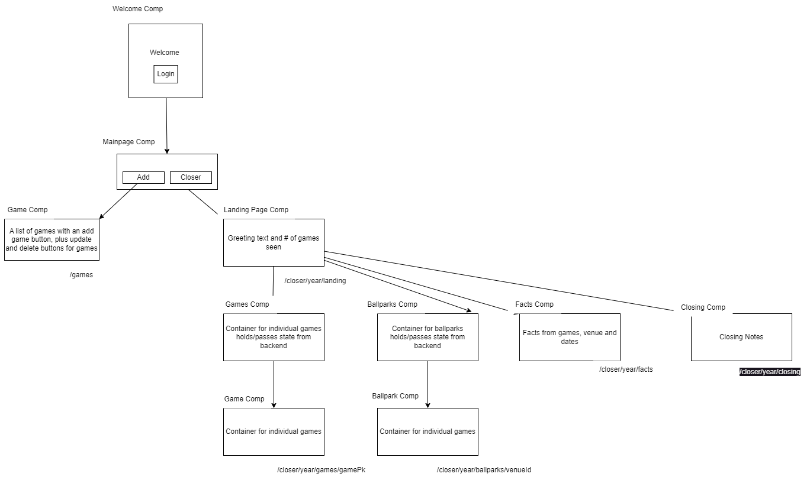

# mlb-wrapped: Closer

## Introduction
An app to summarize your time at the ballpark. View your favorite players, biggest moments, and memories made. 

## User Stories
- As a user want to be able to see all games that I have inteded 
- As a user I want insights such as top plays, moments, and facts from each game I attended 
- As a user I want insights on each ballpark that I attended a game in for that season

## Wireframe
 

## Kanban Board
https://trello.com/b/iA31bF8b/mlb-wrapped-closer

## DrawIo


## API Routes used in React
| Call   | Route                  | Where               | Info                                                                                 |
|--------|------------------------|---------------------|--------------------------------------------------------------------------------------|
| GET    | /users                 | Welcome Component   | Returns user information to access profile and game information                      |
| GET    | /userId/year/games     | User Component      | Returns all games for a specific user for a specific season                          |
| POST   | /userId/games          | User Component      | Adds a new game(s) for the specific user for a specific season, adding to the review |
| DELETE | /userId/games/gamePk   | User Component      | Removes a game for the specific user                                                 |
| PATCH  | /userId/games/gamePk   | User Component      | Updates a game for the specific user                                                 |
| GET    | /userId/year/games     | Games Component     | Returns all game information for a given user for a specific season                  |
| GET    | /userId/year/ballparks | Ballparks Component | Returns all ballpark information for a specific season- a subset of /games           |
| GET    | /userId/year/facts     | Facts Component     |                                                                                      |
| GET    | /userId/closingfacts   | Closing Component   | Returns closing notes for the specific user                                          |

## New Technology
React iframes to render MLB assets in app 

```
function App() {
  return (
    <div className="App">
      <h3>Iframes in React</h3>
      <iframe src="https://www.mlb.com/player/ronald-acuna-jr-660670"></iframe>
    </div>
  );
}
export default App;
```